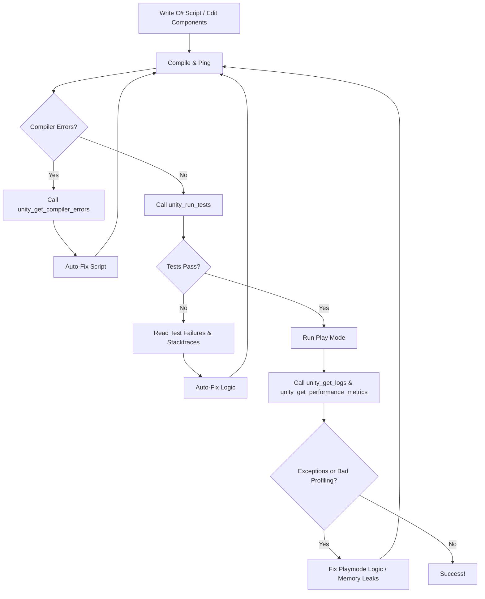

# Unity Editor Interaction & Automation Guide

This skill guides AI agents on how to use the Unity MCP Server tools to inspect, modify, test, and automate tasks inside the Unity Editor.

---

## 1. Project Context Discovery

When starting to work on a task in a Unity project:
1. **Ping**: Call `unity_ping` to confirm the editor is open and see what scene is loaded and what object is currently selected.
2. **Scan Mapping**: Call `unity_get_project_map` to get a complete bird's-eye view of all Scenes, Prefabs, Scripts, and Assembly Definitions (`.asmdef`) in the project. This avoids guessing paths.
3. **Inspect Settings**: Call `unity_get_project_context` to read active tags, layers, color space, active build targets, and the list of packages installed in `manifest.json` (so you know if Cinemachine, Input System, Addressables, etc. are available).

---

## 2. Live Scene Hierarchy & Inspections

- Use `unity_get_scene_hierarchy` to get the list of active GameObjects in the scene.
- Locate the target GameObject and call `unity_get_gameobject_details` with its `instanceId` to inspect component values (e.g. coordinates, materials, script properties).

---

## 3. Modifying GameObjects & Scene States

- Use `unity_create_gameobject` to create objects, attach components, or instantiate prefabs by passing a project path (e.g. `Assets/Prefabs/Player.prefab`).
- Use `unity_update_component` to edit values:
  - **Transform Position**: target component `Transform`, field `position`, value `"1, 2, 3"`.
  - **Color**: target component `Light`, field `color`, value `"#FF0000"` (Hex).
  - **Enums**: target component, field `state`, value `"Patrolling"` (enum name).
- Use `unity_select_gameobject` to change the editor selection to highlight the object you just created or modified, giving visual feedback to the developer.

---

## 4. Advanced Editor Automation (Dynamic Script Execution)

For complex tasks (grid placements, batch modifications, binding references dynamically):
- Use `unity_execute_script`.
- Write a short C# script body that performs the automation using UnityEditor APIs.
- The script body **must** return a string representing the output of the execution.

---

## 5. The Autonomous Self-Healing Loop (TDD Workflow)

When implementing game logic or fixing bugs, follow this loop strictly to ensure correctness:

1. **Write/Modify code**: Edit scripts, or update GameObject fields.
2. **Compile**: Check if Unity compiles. If errors occur, call `unity_get_compiler_errors` to get the exact file, line number, and compiler message. Auto-fix the code and compile again.
3. **Unit Tests**: Call `unity_run_tests` to run all EditMode and PlayMode tests in the project. If any test fails, inspect the JSON output (which contains the test name, message, and stack trace) to target and fix the bug.
4. **Integration/Play Test**: Enter Play Mode using `unity_control_playmode` with state `"play"`. Allow the game to run for a few seconds.
5. **Console & Profiler Check**: Call `unity_get_logs` and `unity_get_performance_metrics`. Check for:
   - Any NullReferenceException, MissingReferenceException, or other errors in logs.
   - Any warning signs in performance metrics (e.g. excessive monoHeapSize or monoUsedSize allocations).
6. **Stop**: Call `unity_control_playmode` with state `"stop"`. If errors were found, fix them and repeat the loop.
